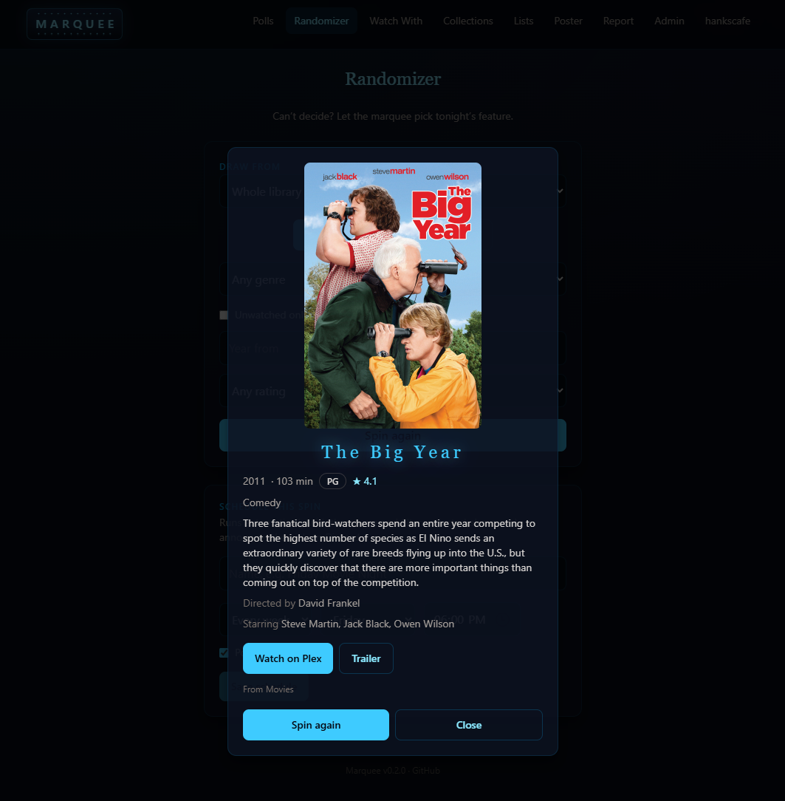
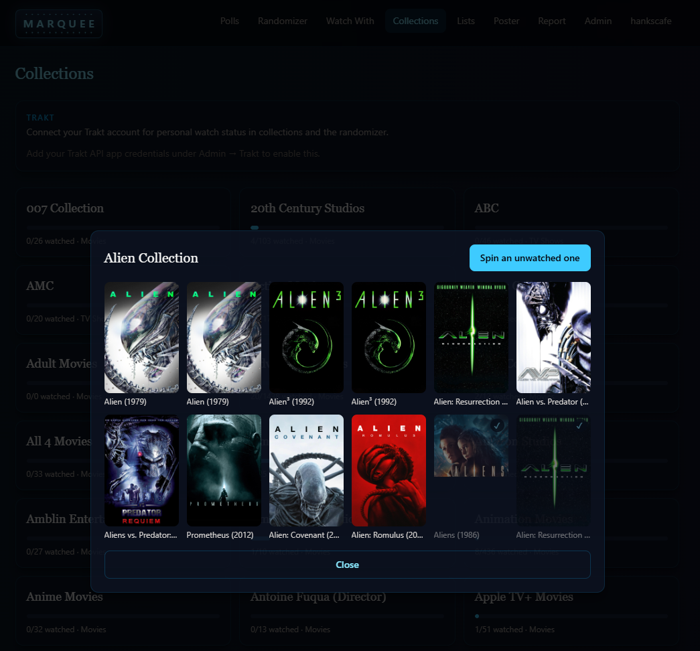

# Marquee

**Self-hosted movie night, decided together.** Build polls from your Plex, Jellyfin, or Emby library, share a link, let everyone vote once, and let the marquee announce tonight's feature — or spin the randomizer when nobody can decide.

[](https://github.com/hankscafe/marquee/actions/workflows/ci.yml)
[](LICENSE)


## Features

### Polls

Pick titles from your library (search, filter by library or genre, or add a whole collection at once), share via link, and vote by tapping a poster — **one vote per person, enforced by the database**. Results update live for everyone watching. Polls can auto-open and auto-close on a schedule, with the winner computed automatically (ties broken at random). Admins can pin important polls to the top.


Poll cards show each option's poster sized by its share of the vote — front-runners literally grow. Closed polls show the winning title.


### Randomizer

Can't decide? Draw a random title from the whole library, a single library, a server collection, or a custom list — filtered by movie/show, genre, year range, minimum rating, and **your personal watch history**. Save any spin as a weekly or one-time schedule with optional Discord announcements.


The pick is revealed in a modal — spin again right there until something sticks.



### Collections & film series

Browse your server's collections with per-person watched progress, and let the TMDb-powered franchise scan find film series your library has *started* — with one-click requests to Overseerr/Jellyseerr/Ombi for the missing entries.


Open any collection to see its titles and who's watched what, or spin an unwatched pick from it.



### Watch With

Two people, one pick. **Library mode** finds a random title *neither* of you has seen (per-person history via Trakt, your own Plex account, or the server account). **Watchlist mode** intersects both plex.tv watchlists and picks from the overlap — with a request button if the pick isn't in the library yet.


### Cinema Poster Mode

A fullscreen display for a wall-mounted tablet or TV: whatever's playing on your server right now with a live progress bar, viewer name, and end time — cycling through simultaneous streams, and rotating library posters when idle.


### Discord

Post a poll to a channel and people vote with buttons — **no Marquee account needed**. Counts update live in both places, and the bot announces the winner when the poll closes. Scheduled randomizer picks announce there too.

### Everything else

- **Media servers**: Plex, Jellyfin, and Emby — any combination at once, with cross-server de-duplication
- **Sign-in options**: local accounts, Sign in with Plex (popup PIN flow), Jellyfin/Emby credentials, OIDC (Authentik/Authelia/Keycloak/…), and passkeys (WebAuthn)
- **User management**: create accounts, import your Plex Home members and friends in one click, set/reset passwords, promote admins, disable open registration
- **Trakt**: users connect their own accounts for personal watch status everywhere
- **Issue reports**: users flag problems to the admin in-app
- **PWA**: install on phones and desktops; touch-friendly, movie-theater dark theme

## Quick start (Docker)

```yaml
# docker-compose.yml
services:
  marquee:
    image: ghcr.io/hankscafe/marquee:latest
    container_name: marquee
    ports:
      - "3000:3000"
    volumes:
      - ./data:/data
    restart: unless-stopped
```

```bash
docker compose up -d
```

Open the app, create the first admin account, then in **Admin → Media servers** add your Plex/Jellyfin/Emby details and hit **Sync all libraries now**. All state lives in `./data` — back up that folder and you've backed up everything.

## Configuration

| Env var | Default | Purpose |
| --- | --- | --- |
| `PORT` | `3000` | HTTP port |
| `DATA_DIR` | `/data` (Docker) | Database, instance secret |
| `DATABASE_PATH` | `$DATA_DIR/marquee.db` | SQLite file location |
| `SESSION_SECRET` | auto-generated, persisted in `$DATA_DIR` | Cookie signing + secrets-at-rest key |
| `LOG_LEVEL` | `info` (prod) / `debug` (dev) | `trace`–`error` |
| `TRUST_PROXY` | `true` | Trust `X-Forwarded-*` from a reverse proxy. Set `false` if exposing the server directly (prevents client IP spoofing that would bypass login rate limits). Also accepts a hop count or IP/CIDR allowlist. |
| `ADMIN_IDLE_MINUTES` | `120` | Minutes of inactivity before an **admin** session is auto-logged-out |
| `USER_IDLE_MINUTES` | `360` | Minutes of inactivity before a regular **user** session is auto-logged-out |

Everything else — media servers, Trakt, TMDb, Discord, request services, OIDC, the public app URL — is configured in the Admin UI, not env vars.

### Integrations (all optional)

| Integration | What you need | What it unlocks |
| --- | --- | --- |
| **Plex** | Server URL + [X-Plex-Token](https://support.plex.tv/articles/204059436-finding-an-authentication-token-x-plex-token/) | Library sync, Sign in with Plex, user import, Watch With |
| **Jellyfin / Emby** | Server URL + API key (dashboard) | Library sync, credential sign-in |
| **Trakt** | Free [API app](https://trakt.tv/oauth/applications) (redirect URI `urn:ietf:wg:oauth:2.0:oob`) | Per-user watch history |
| **TMDb** | Free [API key](https://www.themoviedb.org/settings/api) | Film-series scan + missing-title detection |
| **Discord** | Bot token + channel ID | Poll voting from Discord, winner announcements |
| **Overseerr / Jellyseerr / Ombi** | Service URL + API key | One-click requests for missing titles |
| **OIDC** | Issuer URL + client ID/secret | Single sign-on |

## Widget API

A read-only JSON endpoint for external dashboards (e.g. [gethomepage.dev](https://gethomepage.dev)) — show the current poll's standings, or the spotlight poll and its winner, on a wall display.

**Enable it:** Admin → Integrations → **Homepage widget API** → *Generate key*. The key is shown once — copy it. You can rotate or revoke it any time; the endpoint stays disabled (`404`) until a key exists.

**Auth:** send the key as a header (either form works, matching Homepage's custom-header support):

```
Authorization: Bearer <key>
```
```
X-API-Key: <key>
```

Requests without a valid key get `401`. The endpoint is rate-limited and never exposes draft polls.

**Endpoints**

| Request | Returns |
| --- | --- |
| `GET /api/widget/polls` | The spotlight poll plus all open/closed polls |
| `GET /api/widget/polls?spotlight=1` | Only the spotlight poll (and its winner once closed) |

```bash
curl -H "Authorization: Bearer $KEY" "https://marquee.example.com/api/widget/polls?spotlight=1"
```

```json
{
  "generatedAt": "2026-07-07T18:00:00.000Z",
  "spotlight": {
    "title": "Friday Movie Night",
    "status": "closed",
    "url": "https://marquee.example.com/p/xmSS0yKpLi63",
    "totalVotes": 5,
    "optionCount": 5,
    "closesAt": null,
    "leader": null,
    "winner": { "title": "The Big Year (2000)", "votes": 3, "percent": 60 },
    "options": [
      { "title": "The Big Year (2000)", "votes": 3, "percent": 60 },
      { "title": "Longlegs (2001)", "votes": 1, "percent": 20 }
    ]
  }
}
```

`leader` is the front-runner while a poll is open (`null` once closed or with no votes); `winner` is set once it closes; `url` needs the public app URL (Admin → Discord card). The default mode adds a `polls` array of the same shape.

**Homepage (gethomepage.dev) example**

```yaml
- Movie night:
    widget:
      type: customapi
      url: https://marquee.example.com/api/widget/polls?spotlight=1
      headers:
        X-API-Key: your-key-here
      mappings:
        - field: spotlight.title
          label: Now voting
        - field: spotlight.leader.title
          label: Leading
        - field: spotlight.totalVotes
          label: Votes
```

## Security

- Integration secrets and user OAuth tokens are **encrypted at rest** (AES-256-GCM) with a key derived from the instance secret — a copy of the database alone exposes nothing
- The widget API key is encrypted at rest too, sent only as a header, and compared in constant time
- Passwords hashed with scrypt; sessions in signed, HTTP-only, SameSite cookies (Secure over TLS)
- Rate limiting on all credential endpoints; security headers via Helmet
- Media-server tokens/keys never reach the browser — posters proxy through the server
- Registration can be disabled for invite-only instances

**Run it behind HTTPS** (Caddy, Traefik, nginx, or a Cloudflare tunnel). Passkeys require it (or localhost), and it's the right call for anything public-facing. Marquee sits happily behind a reverse proxy (`trustProxy` is on).

## Development

Requires Node 22+.

```bash
npm install
npm run dev        # API on :3000, client with HMR on :5173
npm run build      # production build
npm run typecheck
npm run db:generate  # regenerate migrations after schema changes
```

The stack: Fastify + SQLite (Drizzle ORM) on the server, React + Vite + Tailwind PWA on the client, shared wire types in `shared/`. One Docker container in production; the server serves the built client.

## Roadmap

- Device control — power on Apple TV/TVs and open the pick in the right app
- Watch With for partners without accounts (blocked on plex.tv's undocumented community API)
- Jellyfin/Emby per-user watch history in Watch With

## License

[MIT](LICENSE)
